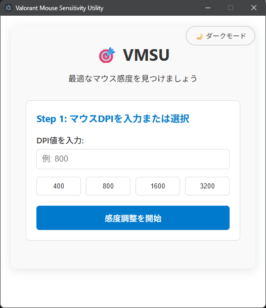
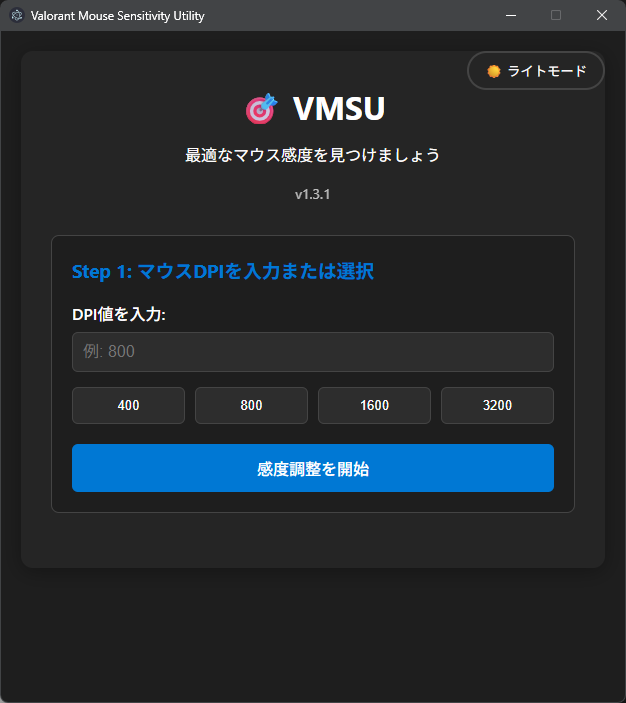
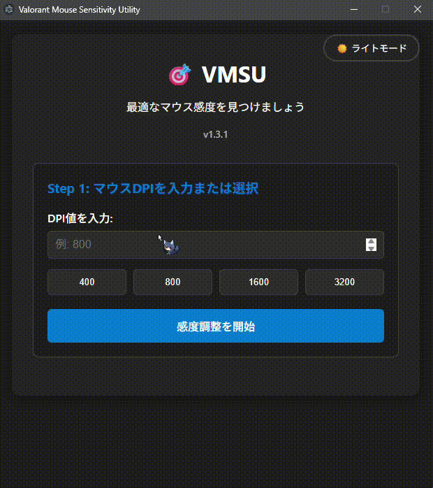

# 🎯 Valorant Mouse Sensitivity Utility

[](https://opensource.org/licenses/ISC)
[](https://www.electronjs.org/)
[](https://github.com/electron/electron)
[](https://github.com/saica1101/valorant-mouse-sensitivity-utility/releases)

Valorantプレイヤー向けの最適なマウス感度を見つけるためのElectronアプリケーションです。**三分探索アルゴリズム**と**Natural PSA（Practical Sensitivity Algorithm）**の2つの手法を使用して、効率的にあなたにぴったりの感度設定を発見できます。

## 🌐 多言語対応

- 🇯🇵 **日本語** - 完全対応
- 🇺🇸 **English** - Full support

## 📸 スクリーンショット
> NOTE: 画像は開発中の物であり実際の物とは異なる場合があります。

### ライトモード


### ダークモード  


### 使用デモ


## ✨ 機能

- 🔍 **2つの感度探索アルゴリズム**:
  - **三分探索**: 効率的な数学的アプローチ
  - **Natural PSA**: より自然で直感的な調整手法
- 🌐 **多言語対応**: 日本語・英語の完全サポート
- 🖱️ **DPI対応**: 400, 800, 1600, 3200の一般的なDPI値 + カスタム入力
- 🌙 **テーマ切り替え**: ライトモード・ダークモード対応
- 💾 **設定保存**: テーマ、言語、アルゴリズム設定の自動保存・復元
- 🎮 **Valorant特化**: ゲーム向けに最適化された感度計算
- 🔄 **自動アップデート**: GitHubリリースからの自動更新機能
- ♿ **アクセシビリティ**: キーボードナビゲーション、スクリーンリーダー対応
- 🎯 **パフォーマンス最適化**: 軽量でスムーズな動作

## 🚀 クイックスタート

### ダウンロード
[クライアントのダウンロード](https://github.com/saica1101/valorant-mouse-sensitivity-utility/releases)

## 🎯 使用方法

### 初期設定
1. **言語選択**: メニューから日本語または英語を選択
2. **アルゴリズム選択**: メニューから使用する感度調整手法を選択
   - **三分探索**: 数学的に効率的な探索手法
   - **Natural PSA**: より自然で直感的な調整手法

### Step 1: DPI設定
- マウスのDPI値を入力するか、プリセット値（400, 800, 1600, 3200）から選択
- 「感度調整を開始」をクリック

### Step 2: 感度調整

#### 三分探索アルゴリズム
1. 2つの候補感度値（候補A、候補B）が表示されます
2. 各感度値をValorantで試して比較
3. より快適だと感じる方を選択:
   - 👈 **Aが快適**: 候補Aの方が好ましい場合
   - 👉 **Bが快適**: 候補Bの方が好ましい場合
   - 🟰 **どちらも同じ**: 両方とも同程度に快適な場合
4. 選択に基づいて次の候補が表示されます

#### Natural PSA（Practical Sensitivity Algorithm）
1. 現在の感度値が表示されます
2. Valorantでテストして、感度の調整が必要かを判断
3. 調整方向を選択:
   - 📈 **上げる**: 感度を高くしたい場合
   - 📉 **下げる**: 感度を低くしたい場合
   - ✅ **完了**: 現在の感度が最適な場合
4. 7回の反復で段階的に最適値に収束します

### Step 3: 完了
- 最適な感度が見つかると「Finish」メッセージが表示
- 「Reset」ボタンで新しい調整を開始可能
- 設定は自動的に保存され、次回起動時に復元されます

### 📱 メニュー機能
- **言語設定**: 日本語 ⇄ English の切り替え
- **アルゴリズム設定**: 三分探索 ⇄ Natural PSA の切り替え
- **テーマ設定**: ライトモード ⇄ ダークモード の切り替え

### 自動アップデート機能
- アプリ起動時と10分間隔で自動的に新しいバージョンをチェック
- 新しいバージョンが利用可能な場合、バックグラウンドで自動ダウンロード
- ダウンロード完了時にユーザーに通知し、再起動確認ダイアログを表示
- ユーザーの承認後、アプリが自動再起動してアップデートが適用

## ⚙️ 技術仕様

### アルゴリズム詳細

#### 三分探索アルゴリズム
```
base_sensi = 80
lower_bound = base_sensi / input_DPI
upper_bound = lower_bound * 8

# 三分点の計算
range = upper_bound - lower_bound
left_third = lower_bound + range / 3
right_third = lower_bound + (2 * range) / 3
```

感度調整は三分探索で行われ、探索範囲を3つに分割して2つの候補点で比較を行います。
ユーザーの選択に基づいて探索範囲を絞り込み、上限と下限の差が0.001未満になるまで継続されます。

**三分探索の利点:**
- 人間の感覚による判定エラーに対してロバスト
- 「どちらも同じ」という選択肢により、不確実な判断の影響を軽減
- PSAメソッドの理論に基づいた、より信頼性の高い感度探索

#### Natural PSA（Practical Sensitivity Algorithm）
```
# 初期設定
base_sensitivity = 280 / DPI(Valorant Pro Playerの多くがeDPI280の近似値の為)
iterations = 7

# 各反復での調整
current_sensitivity = (selected_sensitivity + previous_d) / 2
adjustment_range = base_sensitivity * (0.6 ** iteration)
```

Natural PSAは7回の反復を通じて段階的に最適な感度に収束します。
各ステップで調整幅が縮小され、より精密な調整が可能になります。

**Natural PSAの利点:**
- より自然で直感的な調整プロセス
- 段階的な収束により精密な感度調整が可能
- 実際のゲームプレイに近い調整体験

### 技術スタック
- **フレームワーク**: Electron 37.3.0
- **言語**: JavaScript (ES6+)
- **UI**: HTML5, CSS3 (CSS Variables for theming)
- **国際化**: カスタムi18nシステム with localStorage persistence
- **IPC通信**: Electron IPC for main-renderer communication
- **設定管理**: JSON-based settings with auto-save/restore
- **パフォーマンス**: Optimized monitoring with conditional execution
- **ビルドツール**: Electron Forge
- **自動アップデート**: update-electron-app + GitHub Releases
- **アクセシビリティ**: ARIA attributes, keyboard navigation support

## 📁 プロジェクト構造

```
valorant-mouse-sensitivity-utility/
├── main.js              # Electronメインプロセス（メニュー、設定管理）
├── preload.js           # プリロードスクリプト（IPCブリッジ）
├── index.html           # メインHTML（多言語対応、アクセシビリティ）
├── styles/
│   └── main.css         # メインスタイルシート（テーマサポート）
├── scripts/
│   ├── app.js           # アプリケーションロジック（両アルゴリズム実装）
│   ├── i18n.js          # 国際化システム（日本語・英語サポート）
│   └── performance.js   # パフォーマンス最適化（開発・本番切り替え）
├── package.json         # プロジェクト設定（v1.4.0）
├── forge.config.js      # Electron Forge設定
└── README.md           # このファイル
```

## 🎨 機能詳細

### 多言語サポート
- **完全な日本語対応**: UI、メニュー、メッセージ
- **English support**: Full localization
- **設定の永続化**: 言語設定は自動保存・復元
- **リアルタイム切り替え**: アプリ再起動不要

### テーマシステム
アプリケーションには2つのテーマが用意されています：

- **ライトモード**: 明るい背景で日中の使用に最適
- **ダークモード**: 暗い背景で目に優しく、長時間の使用に適している

テーマ設定はローカルストレージに自動保存され、次回起動時に復元されます。

### アクセシビリティ機能
- **キーボードナビゲーション**: 全機能をキーボードで操作可能
- **スクリーンリーダー対応**: ARIA属性による支援技術サポート
- **フォーカス管理**: 明確なフォーカスインジケーター
- **ハイコントラスト対応**: 視認性を重視したカラーパレット

### パフォーマンス最適化
- **条件付き監視**: 開発環境でのみデバッグ機能を有効化
- **メモリ効率**: 効率的なキャッシュとガベージコレクション
- **CPU最適化**: 不要な処理の削減とリソース管理
- **レスポンシブUI**: スムーズな操作感とリアルタイム更新

## 🤝 コントリビューション

プルリクエストを歓迎します！大きな変更を行う場合は、まずIssueを作成して変更内容について議論してください。

### 開発環境のセットアップ
1. このリポジトリをフォーク
2. 機能ブランチを作成 (`git checkout -b feature/amazing-feature`)
3. 変更をコミット (`git commit -m 'Add some amazing feature'`)
4. ブランチにプッシュ (`git push origin feature/amazing-feature`)
5. プルリクエストを作成

## 📝 ライセンス

このプロジェクトは[ISC License](LICENSE)の下で公開されています。

## 🔗 関連リンク

- [Valorant公式サイト](https://playvalorant.com/)
- [Electron公式ドキュメント](https://www.electronjs.org/docs)
- [リリースページ](https://github.com/saica1101/valorant-mouse-sensitivity-utility/releases)

## 📞 サポート

問題が発生した場合や質問がある場合は、[Issues](https://github.com/saica1101/valorant-mouse-sensitivity-utility/issues)を作成してください。

## 📊 更新履歴

### v1.4.0 (Latest)
- ✨ Natural PSAアルゴリズムの追加
- 🌐 完全な多言語対応（日本語・英語）
- 💾 設定の永続化（言語・アルゴリズム・テーマ）
- ♿ アクセシビリティ機能の強化
- 🚀 パフォーマンス最適化
- 🎯 メニューシステムの実装

---

**Made with ❤️ for Valorant players**

> **Note**: このツールはValorant公式ツールではありません。コミュニティによって作成された非公式のユーティリティです。
